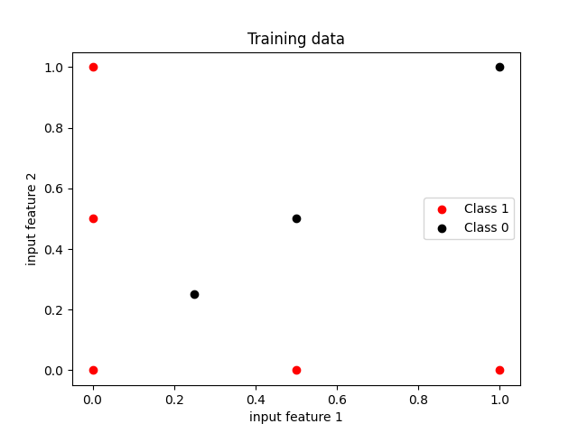
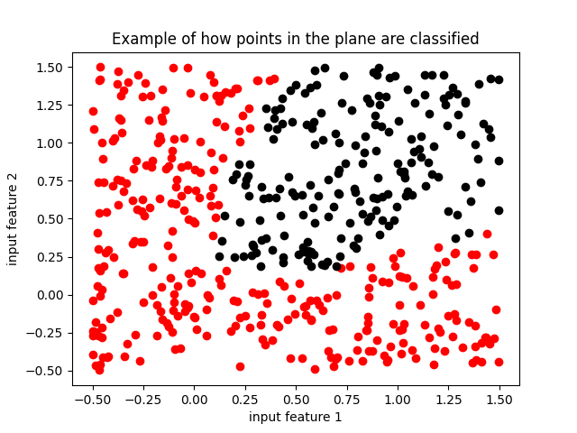
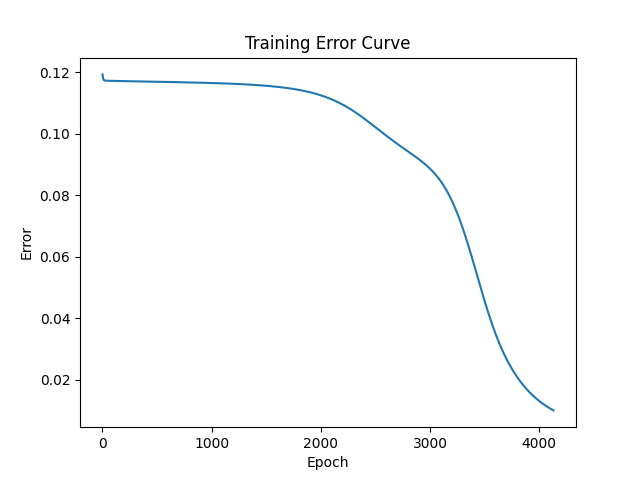

# Backpropagation

Implementation of the backpropagation algorithm for multilayer neural networks in Python.

**Example**

How points in the plane are classified by the neural network after training has been done on the training data:

