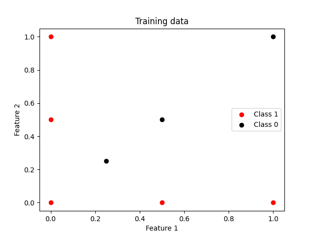
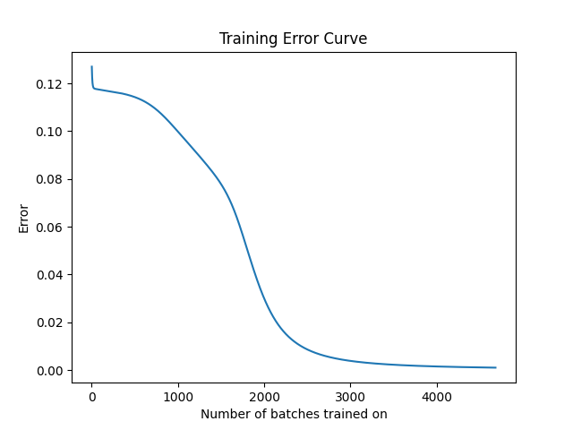

# Backpropagation

Implementation of the backpropagation algorithm for a fully connected multilayer neural network in Python.

 Using sigmoid activation,
 
 $s(x) = \frac1{1 + e^{-x}}$,
 
 at each node, and error function
 
 $e(x) = \frac1{2}(x - y)^2$.

**Example**:

Classification of 500 random points after training:

